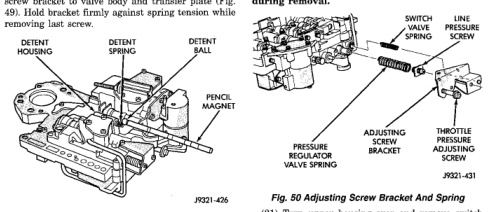
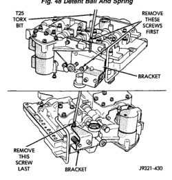

*Fig. 48*

(18) Position pencil magnet next to detent housing to catch detent ball and spring. Then carefully remove Retainer Tool 6583 and remove detent ball and spring (Fig. 48). (19) Remove screws attaching pressure adjusting screw bracket to valve body and transfer plate (Fig. 49). Hold bracket firmly against spring tension while removing last screw.

*Fig. 48 Detent Ball And Spring*

*Fig. 49 Adjusting Screw Bracket Fastener*

(20) Remove adjusting screw bracket, line pressure adjusting screw, pressure regulator valve spring and switch valve spring (Fig. 50). Do not remove throttle pressure adjusting screw from bracket and do not disturb setting of either adjusting screw during removal.

(21) Turn upper housing over and remove switch valve, regulator valve and spring, and manual valve (Fig. 51). (22) Remove kickdown detent, kickdown valve, and throttle valve and spring (Fig. 51). (23) Loosen left-side 3-4 accumulator housing attaching screw about 2-3 threads. Then remove center and right-side housing attaching screws (Fig. 52). (24) Carefully rotate 3-4 accumulator housing upward and remove 3-4 shift valve spring and converter clutch valve plug and spring (Fig. 53). (25) Remove left-side screw and remove 3-4 accumulator housing from valve body (Fig. 54).
