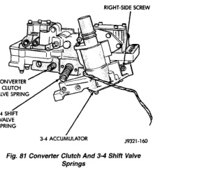
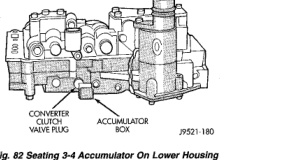

*Fig. 81*

(1) Position converter clutch valve and 3-4 shift valve springs in housing (Fig. 81). (2) Loosely attach accumulator housing with rightside screw (Fig. 81). Install only one screw at this time as accumulator must be free to pivot upward for ease of installation. (3) Install 3-4 shift valve and spring. (4) Install converter clutch timing valve and spring. (5) Position plug on end of converter clutch valve spring. Then compress and hold springs and plug in place with fingers of one hand. (6) Swing accumulator housing upward over valve springs and plug. (7) Hold accumulator housing firmly in place and install remaining two attaching screws. Be sure springs and clutch valve plug are properly seated (Fig. 82). Tighten screws to 4 N-m (35 in. Ibs.).

(1) Install boost valve, valve spring, retainer and cover plate. Tighten cover plate screws to 4 N-m (35 in. Ibs.) torque. (2) Insert manual lever detent spring in upper housing. (3) Position detent ball on end of spring. Then hold detent ball and spring in detent housing with Retainer Tool 6583 (Fig. 83). (4) Install throttle lever in upper housing. Then install manual lever over throttle lever and start manual lever into housing.

*Fig. 81 Converter Clutch And 3-4 Shift Valve Springs*

*Fig. 82*

(5) Align manual lever with detent ball and manual valve. Hold throttle lever upward. Then press down on manual lever until fully seated. Remove detent ball retainer tool after lever is seated. (6) Then install manual lever seal, washer and E-clip. (7) Verify that throttle lever is aligned with end of kickdown valve stem and that manual lever arm is engaged in manual valve (Fig. 84). (8) Position line pressure adjusting screw in adjusting screw bracket. (9) Install spring on end of line pressure regulator valve. (10) Install switch valve spring on tang at end of adjusting screw bracket. (11) Install manual valve. (12) Install throttle valve and spring. (13) Install kickdown valve and detent.
