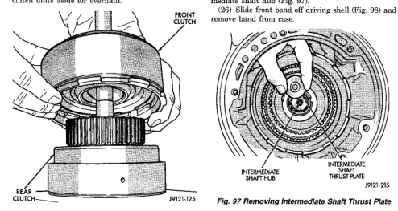
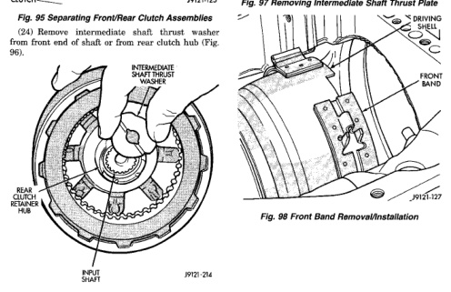

*Fig. 95*

BF

(23) Lift front clutch off rear clutch (Fig. 95). Set clutch units aside for overhaul.

*Fig. 96 Removing Intermediate Shaft Thrust Washer*

(25) Remove output shaft thrust plate from intermediate shaft hub (Fig. 97). (26) Slide front band off driving shell (Fig. 98) and remove band from case.

*Fig. 97 Removing Intermediate Shaft Thrust Plate*

*Fig. 98 Front Band Removal/installation*

*Fig. 96*
