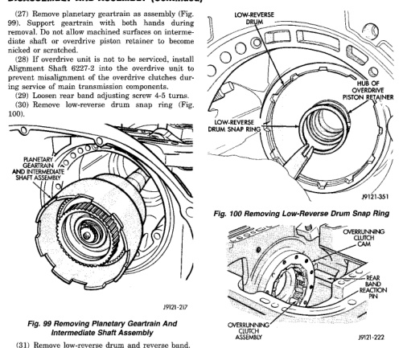

*Fig. 101*

(31) Remove low-reverse drum and reverse band. (32) Remove overrunning clutch roller and spring assembly as a unit (Fig. 101). (33) Compress front servo rod guide about 1/8 inch with Valve Spring Compressor C-3422-B (Fig. 102). (34) Remove front servo rod guide snap ring. Exercise caution when removing snap ring. Servo bore can be scratched or nicked if care is not exercised. (35) Remove compressor tools and remove front servo rod guide, spring and servo piston. (36) Compress rear servo spring retainer about 1/16 inch with Valve Spring Compressor C-3422-B (Fig. 103). (37) Remove rear servo spring retainer snap ring. Then remove compressor tools and remove rear servo spring and piston. (38) Inspect transmission components.

*Fig. 100 Removing Low-Reverse Drum Snap Ring*

Fig. 101 Overrunning Clutch Assembly Removal NOTE: TO SERVICE THE OVERRUNNING CLUTCH CAM OR OVERDRIVE PISTON RETAINER, REFER TO OVERRUNNING CLUTCH CAM SERVICE IN THIS SECTION.

Do not allow dirt, grease, or foreign material to enter the case or transmission components during assembly. Keep the transmission case and components clean. Also make sure the tools and workbench area used for assembly operations are equally clean. Shop towels used for wiping off tools and hands must be made from lint free material. Lint will stick to transmission parts and could interfere with valve operation, or even restrict fluid passages. Lubricate the transmission components with Mopar® transmission fluid during reassembly. Use
