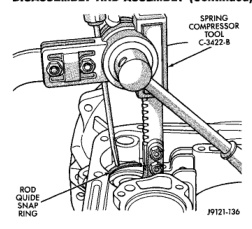
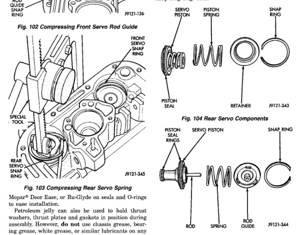

*Fig. 104*

Mopar® Door Ease, or Ru-Glyde on seals and O-rings to ease installation. Petroloum jelly can also be used to hold thrust washers, thrust plates and gaskets in position during assembly. However, do not use chassis grease, bearing grease, white grease, or similar lubricants on any transmission part. These types of lubricants can eventually block or restrict fluid passages and interfere with valve operation. Use petroleum jelly only. Do not force parts into place. The transmission components and subassemblies are easily installed by hand when properly aligned.

If a part seems extremely difficult to install, it is either misaligned or incorrectly assembled. Also verify that thrust washers, thrust plates and seal rings are correctly positioned before assembly. These parts can interfere with proper assembly if mis-positioned. The planetary geartrain, front/rear clutch assemblies and oil pump are all much easier to install when the transmission case is upright. (1) Install rear servo piston, spring and retainer (Fig. 104). Install spring on top of servo piston and install retainer on top of spring. (2) Install front servo piston assembly, servo spring and rod guide (Fig. 105). (3) Compress front/rear servo springs with Valve Spring Compressor C-3422-B and install each servo snap ring (Fig. 106).

(4) Lubricate clutch cam rollers with transmission fluid.

(5) Install rear band in case (Fig. 107). Be sure twin lugs on band are seated against reaction pin.

*Fig. 105*
