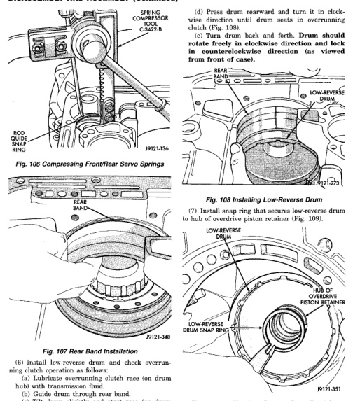

*Fig. 106*

21 - 146

*Fig. 106 Compressing Front/Rear Servo Springs*

(6) Install low-reverse drum and check overrunning clutch operation as follows: (a) Lubricate overrunning clutch race (on drum hub) with transmission fluid. (b) Guide drum through rear band. (c) Tilt drum slightly and start race (on drum hub) into overrunning clutch rollers.

*Fig. 109 Installing Low-Reverse Drum Retaining Snap Ring*
