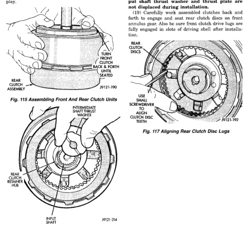

(13) Align clutch dises in front clutch and install front clutch on rear clutch (Fig. 115). Rotate front clutch retainer back and forth until completely seated on rear clutch retainer. (14) Coat intermediate shaft thrust washer with petroleum jelly. Then install washer in rear clutch hub (Fig. 116). Use enough petroleum jelly to hold washer in place. Be sure grooved side of washer faces rearward (toward output shaft) as shown. Also note that washer only fits one way in clutch hub. Note thickness of this washer. It is a select fit part and is used to control transmission end play.

*Fig. 115 Assembling Front And Rear Clutch Units*

*Fig. 116 Installing Intermediate Shaft Thrust Plate*

(15) Align drive teeth on rear clutch discs with small screwdriver (Fig. 117). This makes installation on front planetary easier. (16) Raise front end of transmission upward as far as possible and support case with wood blocks. Front/ rear clutch and oil pump assemblies are easier to install if transmission is as close to upright position as possible. (17) Slide front band into case. (18) Install front and rear clutch units as assembly (Fig. 118). Align rear clutch with front annulus gear and install assembly in driving shell. Be sure output shaft thrust washer and thrust plate are not displaced during installation. (19) Carefully work assembled clutches back and forth to engage and seat rear clutch discs on front annulus gear. Also be sure front clutch drive lugs are fully engaged in slots of driving shell after installation.

*Fig. 117 Aligning Rear Clutch Disc Lugs*

*Fig. 115*
