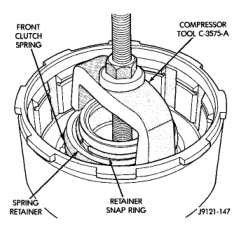
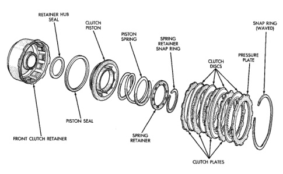

BB

NOTE: The 42RE transmission uses four plates and discs for the front clutch.

(1) Remove waved snap ring and remove pressure plate, clutch plates and clutch discs (Fig. 149). (2) Compress clutch piston spring with Compressor Tool C-3575-A (Fig. 150). Be sure legs of tool are seated squarely on spring retainer before compressing spring. (3) Remove retainer snap ring and remove compressor tool. (4) Remove spring retainer and clutch spring. Note position of retainer on spring for assembly reference. (5) Remove clutch piston from clutch retainer. Remove piston by rotating it up and out of retainer. (6) Remove seals from clutch piston and clutch retainer hub. Discard both seals as they are not reusable.

(1) Soak clutch discs in transmission fluid while assembling other clutch parts.

*Fig. 149*

(2) Install new seals on piston and in hub of retainer. Be sure lip of each seal faces interior of clutch retainer. (3) Lubricate lips of piston and retainer seals with liberal quantity of Mopar® Door Ease. Then lubricate

*Fig. 150 42RE Front Clutch Components*
