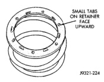
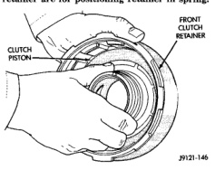
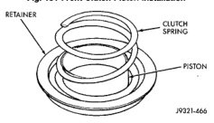

retainer hub, bore and piston with light coat of transmission fluid. (4) Install clutch piston in retainer (Fig. 151). Use twisting motion to seat piston in bottom of retainer.

Never push the clutch piston straight CAUTION: in. This will fold the seals over causing leakage and clutch slip.

(5) Position spring in clutch piston (Fig. 152). (6) Position spring retainer on top of piston spring 153). Make sure retainer is properly (Fig. installed. Small raised tabs should be facing upward. Semicircular lugs on underside of retainer are for positioning retainer in spring.

*Fig. 151 Front Clutch Piston Installation*

*Fig. 152*

(7) Compress piston spring and retainer with Compressor Tool C-3575-A (Fig. 150). Then install new snap ring to secure spring retainer and spring. (8) Install clutch plates and dises (Fig. 149). Install steel plate then disc until all plates and discs are installed. The front clutch uses 4 clutch discs and plates in a 42RE transmission. (9) Install pressure plate and waved snap ring (Fig. 149). Clearance should be 1.70 to 3.40 mm (0.067 to 0.134 in.). If clearance is incorrect, clutch discs,

*Fig. 153 Correct Spring Retainer Installed Position*

plates, pressure plates and snap ring may have to be changed.

(1) Remove fiber thrust washer from forward side of clutch retainer. (2) Remove input shaft front/rear seal rings. (3) Remove selective clutch pack snap ring (Fig. 154). (4) Remove top pressure plate, clutch discs, steel plates, bottom pressure plate and wave snap ring and wave spring (Fig. 154). (5) Remove clutch piston with rotating motion. (6) Remove and discard piston seals. (7) Remove input shaft snap-ring (Fig. 155). It may be necessary to press the input shaft in slightly to relieve tension on the snap-ring (8) Press input shaft out of retainer with shop press and suitable size press tool. Use a suitably sized press tool to support the retainer as close to the input shaft as possible.

(1) Soak clutch discs in transmission fluid while assembling other clutch parts. (2) Install new seal rings on clutch retainer hub and input shaft if necessary (Fig. 156). (a) Be sure clutch hub seal ring is fully seated in groove and is not twisted. (3) Lubricate splined end of input shaft and clutch retainer with transmission fluid. Then press input shaft into retainer. Use a suitably sized press tool to support retainer as close to input shaft as possible. (4) Install input shaft snap-ring (Fig. 155). (5) Invert retainer and press input shaft in opposite direction until snap-ring is seated. (6) Install new seals on clutch piston. Be sure lip of each seal faces interior of clutch retainer. (7) Lubricate lip of piston seals with generous quantity of Mopar® Door Ease. Then lubricate retainer hub and bore with light coat of transmission fluid.
