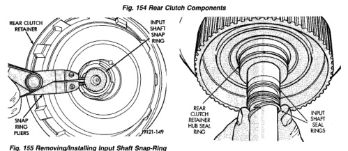
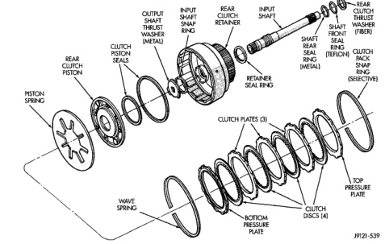

*Fig. 2*

13.5

(8) Install clutch piston in retainer. Use twisting motion to seat piston in bottom of retainer. A thin strip of plastic (about 0.020" thick), can be used to guide seals into place if necessary.

CAUTION: Never push the clutch piston straight in. This will fold the seals over causing leakage and clutch slip. In addition, never use any type of metal

REAR

19121 -538

Fig. 156 Rear Clutch Retainer And Input Shaft Seal Ring Installation

tool to help ease the piston seals into place. Metal tools will cut, shave, or score the seals.

*Fig. 156*
