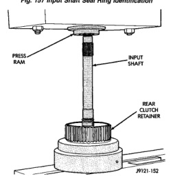
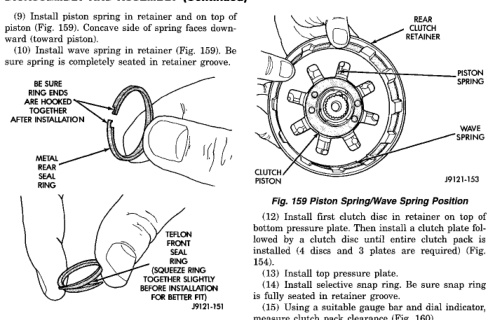

*Fig. 154*

*Fla. 157 Input Shaft Seal Ring Identification*

*Fig. 158 Pressing Input Shaft Into Rear Clutch Retainer*

(11) Install bottom pressure plate (Fig. 154). Ridged side of plate faces downward (toward piston) and flat side toward clutch pack.

(12) Install first clutch disc in retainer on top of bottom pressure plate. Then install a clutch plate followed by a clutch disc until entire clutch pack is installed (4 discs and 3 plates are required) (Fig. 154). (13) Install top pressure plate. (14) Install selective snap ring. Be sure snap ring is fully seated in retainer groove. (15) Using a suitable gauge bar and dial indicator, measure clutch pack clearance (Fig. 160). (a) Position gauge bar across the clutch drum with the dial indicator pointer on the pressure plate (Fig. 160). (b) Using two small screw drivers, lift the pressure plate and release it. (c) Zero the dial indicator. (d) Lift the pressure plate until it contacts the snap-ring and rocord the dial indicator reading. Clearance should be 0.64 - 1.14 mm (0.025 - 0.045 in.). If clearance is incorrect, steel plates, discs, selective snap ring and pressure plates may have to be changed. The selective snap ring thicknesses are: · . 107- 109 in.

• · . 098-. 100 in. · . 095-. 097 in. · . 083-. 085 in. · . 076-. 078 in.

• · . 071-. 073 in.

· . 060-. 062 in. (16) Coat rear clutch thrust washer with petroleum ielly and install washer over input shaft and into clutch retainer (Fig. 161). Use enough petroleum jelly to hold washer in place. (17) Set rear clutch aside for installation during final assembly.
