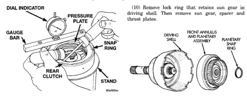
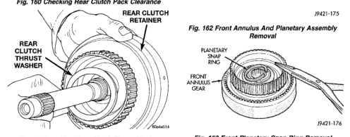
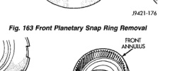

*Fig. 160*

Fig. 160 Checking Rear Clutch Pack Clearance

(1) Remove planetary snap ring (Fig. 162). (2) Remove front annulus and planetary assembly from driving shell (Fig. 162). (3) Remove snap ring that retains front planetary gear in annulus gear (Fig. 163), (4) Remove tabbed thrust washer and tabbed thrust plate from hub of front annulus (Fig. 164). (5) Separate front annulus and planetary gears (Fig. 164). (6) Remove front planetary gear front thrust washer from annulus gear hub. (7) Separate and remove driving shell, rear planetary and rear annulus from output shaft (Fig. 165). (8) Remove front planetary rear thrust washer from driving shell. (9) Remove tabbed thrust washers from rear planetary gear.

Fig. 163 Front Planetary Snap Ring Removal

*Fig. 162*

*J9421-177*

(1) Lubricate output shaft and planetary components with transmission fluid. Use petroleum jelly to

*Fig. 163*
