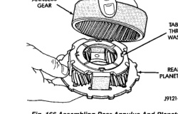
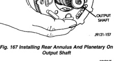

*Fig. 166*

(3) Install rear thrust washer on rear planetary gear. Use enough petroleum jelly to hold washer in place. Also be sure all four washer tabs are properly engaged in gear slots. (4) Install rear annulus over and onto rear planetary gear (Fig. 166). (5) Install assembled rear planetary and annulus gear on output shaft (Fig. 167). Verify that assembly is fully seated on shaft. (6) Install front thrust washer on rear planetary gear (Fig. 168). Use enough petroleum jelly to hold washer on gear. Be sure all four washer tabs are seated in slots. (7) Install spacer on sun gear (Fig. 169),

*Fig. 167 Installing Rear Annulus And Planetary On Output Shaft*

*Fig. 168 Installing Rear Planetary Front Thrust Washer*

*Fig. 169 Installing Spacer On Sun Gear*

*Fig. 167*
