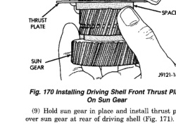

## DISASSEMBLY AND ASSEMBLY (Continued)

(8) Install thrust plate on sun gear (Fig. 170). Note that driving shell thrust plates are interchangeable. Use either plate on sun gear and at front/rear of shell.

*Fig. 170 Installing Driving Shell Front Thrust Plate On Sun Gear]*
- THRUST PLATE
- SUN GEAR
- SPACER
- DRIVING SHELL

(9) Hold sun gear in place and install thrust plate over sun gear at rear of driving shell (Fig. 171).

[Figure: Fig. 171 Installing Driving Shell Rear Thrust Plate]
- DRIVING SHELL
- SUN GEAR
- REAR THRUST PLATE

(10) Position wood block on bench and support sun gear on block (Fig. 172). This makes it easier to align and install sun gear lock ring. Keep wood block handy as it will also be used for geartrain end play check.

[Figure: Fig. 172 Supporting Sun Gear On Wood Block]
- SUN GEAR
- WOOD BLOCK
- DRIVING SHELL

(11) Align rear thrust plate on driving shell and install sun gear lock ring. Be sure ring is fully seated in sun gear ring groove (Fig. 173).

[Figure: Fig. 173 Installing Sun Gear Lock Ring]
- SUN GEAR
- TOOL LOCK GROOVE
- REAR THRUST PLATE
- DRIVING SHELL
- SUN GEAR DRIVING SHELL ASSEMBLY

(12) Install assembled driving shell and sun gear on output shaft (Fig. 174).

[Figure: Fig. 174 Installing Assembled Sun Gear And Driving Shell On Output Shaft]
- OUTPUT SHAFT