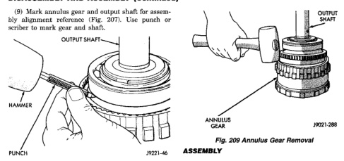
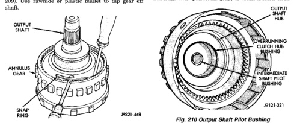

# TRANSMISSION AND TRANSFER CASE 21 - 171

## DISASSEMBLY AND ASSEMBLY (Continued)

(9) Mark annulus gear and output shaft for assembly alignment reference (Fig. 207). Use punch or scriber to mark gear and shaft.

*Fig. 208 Marking Annulus Gear And Output Shaft For Assembly Alignment]*
- HAMMER
- PUNCH
- OUTPUT SHAFT
- ANNULUS GEAR

(10) Remove snap ring that secures annulus gear on output shaft (Fig. 208). Use two screwdrivers to unseat and work snap ring out of groove as shown.

(11) Remove annulus gear from output shaft (Fig. 209). Use rawhide or plastic mallet to tap gear off shaft.

*Fig. 209 Annulus Gear Snap Ring Removal]*
- OUTPUT SHAFT
- ANNULUS GEAR
- SNAP RING

[Figure: Fig. 209 Annulus Gear Removal]
- ANNULUS GEAR
- OUTPUT SHAFT

### ASSEMBLY

**GEARTRAIN AND DIRECT CLUTCH ASSEMBLY**

(1) Soak direct clutch and overdrive clutch discs in Mopar® ATF Plus 3, type 7176, transmission fluid. Allow discs to soak for 10-20 minutes.

(2) Install new pilot bushing and clutch hub bushing in output shaft if necessary (Fig. 210). Lubricate bushings with petroleum jelly, or transmission fluid.

[Figure: Fig. 210 Output Shaft Pilot Bushing]
- OUTPUT SHAFT
- OVERRUNNING CLUTCH HUB
- CLUTCH HUB PILOT BUSHING
- OUTPUT SHAFT PILOT BUSHING

**GEAR CASE AND PARK LOCK DISASSEMBLY**

(1) Remove locating ring from gear case.

(2) Remove park pawl shaft retaining bolt and remove shaft, pawl and spring.

(3) Remove reaction plug snap ring and remove reaction plug.

(4) Remove output shaft seal.