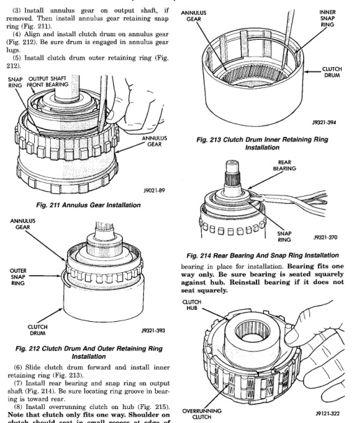

# 21 - 172 TRANSMISSION AND TRANSFER CASE

## DISASSEMBLY AND ASSEMBLY (Continued)

(3) Install annulus gear on output shaft, if removed. Then install annulus gear retaining snap ring.

(4) Align and install clutch drum on annulus gear (Fig. 212). Be sure drum is engaged in annulus gear lugs.

(5) Install clutch drum outer retaining ring (Fig. 212).

*Fig. 211 Annulus Gear Installation]*
- SNAP RING
- OUTPUT SHAFT INNER FRONT BEARING
- ANNULUS GEAR

[Figure: Fig. 212 Clutch Drum And Outer Retaining Ring Installation]
- ANNULUS GEAR
- OUTER SNAP RING
- CLUTCH DRUM

(6) Slide clutch drum forward and install inner retaining ring (Fig. 213).

(7) Install rear bearing and snap ring on output shaft (Fig. 214). Be sure locating ring groove in bearing is toward rear.

(8) Install overrunning clutch on hub (Fig. 215). Note that clutch only fits one way. Shoulder on clutch should seat in small recess at edge of hub.

(9) Install thrust bearing on overrunning clutch hub. Use generous amount of petroleum jelly to hold bearing in place for installation. Bearing fits one way only. Be sure bearing is seated squarely against hub. Reinstall bearing if it does not seat squarely.

[Figure: Fig. 213 Clutch Drum Inner Retaining Ring Installation]
- ANNULUS GEAR
- INNER SNAP RING
- CLUTCH DRUM

[Figure: Fig. 214 Rear Bearing And Snap Ring Installation]
- REAR BEARING
- SNAP RING

[Figure: Fig. 215 Assembling Overrunning Clutch And Hub]
- CLUTCH HUB
- OVERRUNNING CLUTCH