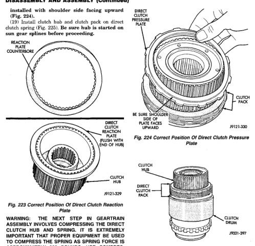

# BR — TRANSMISSION AND TRANSFER CASE 21 - 175

## DISASSEMBLY AND ASSEMBLY (Continued)

installed with shoulder side facing upward (Fig. 224).

(19) Install clutch hub and clutch pack on direct clutch spring (Fig. 225). Be sure hub is started on sun gear splines before proceeding.

*Fig. 223 Correct Position Of Direct Clutch Reaction Plate]*
- REACTION COUNTERBORE
- DIRECT CLUTCH PACK
- FLUSH WITH END OF HUB
- CLUTCH HUB (J9121-329)

[Figure: Fig. 224 Correct Position Of Direct Clutch Pressure Plate]
- DIRECT CLUTCH PRESSURE PLATE
- BE SURE SHOULDER SIDE OF PLATE FACES UPWARD
- CLUTCH PACK (J9121-330)

[Figure: Fig. 225 Direct Clutch Pack And Clutch Hub Installation]
- CLUTCH HUB
- DIRECT CLUTCH PACK
- CLUTCH DRUM (J9121-331)

**WARNING: THE NEXT STEP IN GEARTRAIN ASSEMBLY INVOLVES COMPRESSING THE DIRECT CLUTCH HUB AND SPRING. IT IS EXTREMELY IMPORTANT THAT PROPER EQUIPMENT BE USED TO COMPRESS THE SPRING AS SPRING FORCE IS APPROXIMATELY 830 POUNDS. USE COMPRESSOR TOOL C-6227-1 AND A HYDRAULIC-TYPE SHOP PRESS WITH A MINIMUM RAM TRAVEL OF 6 INCHES. THE PRESS MUST ALSO HAVE A BED THAT CAN BE ADJUSTED UP OR DOWN AS REQUIRED. RELEASE CLUTCH SPRING TENSION SLOWLY AND COMPLETELY TO AVOID PERSONAL INJURY.**

(20) Position Compressor Tool 6227-1 on clutch hub.

(21) Compress clutch hub and spring just enough to place tension on hub and hold it in place.

(22) Slowly compress clutch hub and spring. Compress spring and hub only enough to expose ring grooves for clutch pack snap ring and clutch hub retaining ring.

(23) Realign clutch pack on hub and seat clutch discs and plates in clutch drum.

(24) Install direct clutch pack snap ring (Fig. 226). Be very sure snap ring is fully seated in clutch drum ring groove.

(25) Install clutch hub retaining ring (Fig. 227). Be very sure retaining ring is fully seated in sun gear ring groove.

(26) Slowly release press ram, remove compressor tools and remove geartrain assembly.