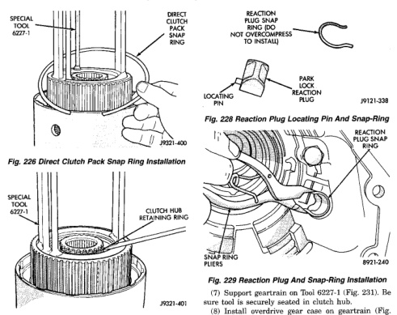
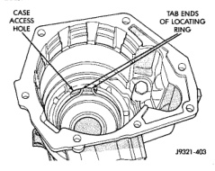

# 21 - 176 TRANSMISSION AND TRANSFER CASE — BR

## DISASSEMBLY AND ASSEMBLY (Continued)

*Fig. 228 Direct Clutch Pack Snap Ring Installation]*
- SPECIAL TOOL 6227-1
- DIRECT CLUTCH PACK SNAP RING

*Fig. 229 Clutch Hub Retaining Ring Installation]*
- SPECIAL TOOL 6227-1
- CLUTCH HUB RETAINING RING (J9121-401)

[Figure: Fig. 228 Reaction Plug Locating Pin And Snap-Ring]
- REACTION PLUG SNAP RING
- DO NOT OVERCOMPRESS TO INSTALL
- PARK LOCK REACTION PLUG (J9121-338)

[Figure: Fig. 229 Reaction Plug And Snap-Ring Installation]
- REACTION PLUG SNAP RING
- SNAP-RING PLIERS (J9121-240)

### GEAR CASE ASSEMBLY

(1) Position park pawl and spring in case and install park pawl shaft. Verify that end of spring with 90° bend is hooked to pawl and straight end of spring is seated against case.

(2) Install pawl shaft retaining bolt. Tighten bolt to 27 N·m (20 ft. lbs.) torque.

(3) Install park lock reaction plug. Note that plug has locating pin at rear (Fig. 228). Be sure pin is seated in hole in case before installing snap ring.

(4) Install reaction plug snap-ring (Fig. 229). Compress snap ring only enough for installation; do not distort it.

(5) Install new seal in gear case. On 4 x 4 gear case, use Tool Handle C-4171 and Installer C-3860-A to seat seal in case. On 4 x 2 gear case, use same Handle C-4171 and Installer C-3995-A to seat seal in case.

(6) Verify that tab ends of rear bearing locating ring extend into access hole in gear case (Fig. 230).

[Figure: Fig. 230 Correct Rear Bearing Locating Ring Position]
- CASE ACCESS HOLE
- TAB ENDS OF LOCATING RING (J9121-403)

(7) Support geartrain on Tool C-6227-1 (Fig. 231). Be sure tool is securely seated in clutch hub.

(8) Install overdrive gear case on geartrain (Fig. 231).

(9) Expand front bearing locating ring with snap ring pliers (Fig. 232). Then slide case downward until