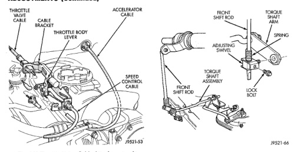

*Fig. 246 Throttle Valve Cable Attachment -At Engine*

taneously and as described in cable adjustment checking procedure.

Check linkage adjustment by starting engine in Park and Neutral. Adjustment is acceptable if the engine starts in only these two positions. Adjustment is incorrect if the engine starts in one position but not both positions If the engine starts in any other position, or if the engine will not start in any position, the park/neutral switch is probably faulty.

Check condition of the shift linkage (Fig. 247). Do not attempt adjustment if any component is loose, worn, or bent. Replace any suspect components. Replace the grommet securing the shift rod or torque rod in place if either rod was removed from the grommet. Remove the old grommet as necessary and use suitable pliers to install the new grommet. (1) Shift transmission into Park. (2) Raise and support vehicle. (3) Loosen lock bolt in front shift rod adjusting swivel (Fig. 247). (4) Ensure that the shift rod slides freely in the swivel. Lube rod and swivel as necessary. (5) Move transmission shift lever fully rearward to the Park detent. (6) Center adjusting swivel on shift rod.

• (7) Tighten swivel lock bolt to 10 N.m (90 in. Ibs.). (8) Lower vehicle and verify proper adjustment.

Fig. 247 Linkage Adjustment Components

The front (kickdown) band adjusting screw is located on the left side of the transmission case above the manual valve and throttle valve levers. (1) Raise vehicle. (2) Loosen band adjusting screw locknut (Fig. 248). Then back locknut off 3-5 turns. Be sure adjusting screw turns freely in case. Apply lubricant to screw threads if necessary. (3) Tighten band adjusting screw to 8 N-m (72 in. Ibs.) torque with Inch Pound Torque Wrench C-3380-A, a 3-in. extension and 5/16 socket.

CAUTION: If Adapter C-3705 is needed to reach the adjusting screw (Fig. 249), tighten the screw to only 5 N-m (47-50 in. Ibs.) torque.

(4) Back off front band adjusting screw 3-5/8 turns. (5) Hold adjuster screw in position and tighten locknut to 41 N-m (30 ft. lbs.) torque. (6) Lower vehicle.

The transmission oil pan must be removed for access to the rear band adjusting screw. (1) Raise vehicle. (2) Remove transmission oil pan and drain fluid. (3) Loosen band adjusting screw locknut 5-6 turns (Fig. 250). Be sure adjusting screw turns freely in lever.
