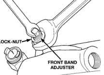
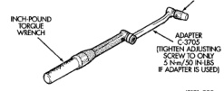

*Fig. 248 Front Band Adjustment Screw Location*

5/16 SOCKET

*Fig. 251*

[Figure]

(4) Tighten adjusting screw to 8 N-m (72 in. lbs.) torque.

(5) Back off adjusting screw 4 turns. (6) Hold adjusting screw in place and tighten locknut to 34 N-m (25 ft. Ibs.) torque. (7) Position new gasket on oil pan and install pan on transmission. Tighten pan bolts to 17 N.m (13 ft. lbs.) torque.

(8) Lower vehicle and refill transmission with Mopar® ATF Plus 3, Type 7176 fluid.

There are two control pressure adjustments on the valve body: · Line Pressure · Throttle Pressure Line and throttle pressures are interdependent because each affects shift quality and timing. As a result, both adjustments must be performed properly and in the correct sequence. Adjust line pressure first and throttle pressure last.

Measure distance from the valve body to the inner edge of the adjusting screw with an accurate steel scale (Fig. 251). Distance should be 33.4 mm (1-5/16 in.). If adjustment is required, turn the adjusting screw in, or out, to obtain required distance setting.

NOTE: The 33.4 mm (1-5/16 in.) setting is an approximate setting. Manufacturing tolerances may make it necessary to vary from this dimension to obtain desired pressure.

One complete turn of the adjusting screw changes line pressure approximately 1-2/3 psi (9 kPa). Turning the adjusting screw counterclockwise increases pressure while turning the screw clockwise decreases pressure.

Insert Gauge Tool C-3763 between the throttle lever cam and the kickdown valve stem (Fig. 252).

[Figure]
