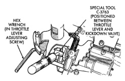

*Fig. 2*

13.0

Push the gauge tool inward to compress the kickdown valve against the spring and bottom the throttle valve. Maintain pressure against kickdown valve spring. Turn throttle lever stop screw until the screw head touches throttle lever tang and the throttle lever cam touches gauge tool.

NOTE: The kickdown valve spring must be fully compressed and the kickdown valve completely bottomed to obtain correct adjustment.

SCHEMATICS AN DIAGRAMS

HYDRAULIC SCHEMATICS

*Fig. 252*

J9521-109

Fig. 252 Throttle Pressure Adjustment
