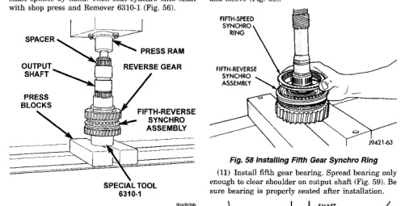
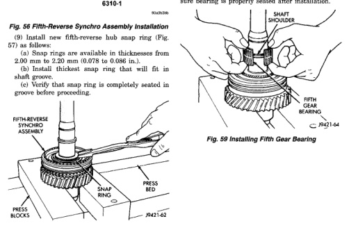

*Fig. 56*

(8) Start fifth-reverse synchro assembly on output shaft splines by hand. Then seat synchro onto shaft with shop press and Remover 6310-1 (Fig. 56).

*Fig. 57 Installing Fifth-Reverse Synchro Hub Snap Ring*

(10) Install fifth gear synchro ring in synchro hub and sleeve (Fig. 58).

*Fig. 59 Installing Fifth Gear Bearing*

*Fig. 57*
