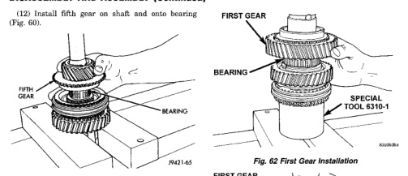

*Fig. 62*

(15) Install first gear on shaft and over bearing (Fig. 62). Make sure bearing synchro cone is facing up as shown. (16) Install first gear synchro ring (Fig. 63). (17) Assemble 1-2 synchro hub sleeve, springs, struts and detent balls.

(18) Start 1-2 synchro assembly on shaft by hand (Fig. 64). Be sure synchro sleeve is properly positioned. Side marked first side must be facing first gear. (19) Press 1-2 synchro onto output shaft using suitable size pipe tool and shop press (Fig. 65).

CAUTION: Take time to align the synchro ring and sleeve as hub the is being pressed onto the shaft. The synchro ring can be cracked if it becomes misaligned.

[Figure]
