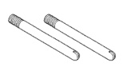
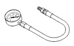
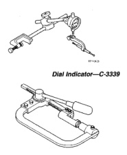

## SPECIAL TOOLS

### RE TRANSMISSIONS

*Fig. 4 Spring Compressor and Alignment Shaft—6227*

*Fig. 5 Gauge Bar—6311*

*Fig. 6 Extension Housing Pilot—C-3288-B*

[Figure: Pressure Gauge—C-3292]

[Figure: Pressure Gauge—C-3293SP]

[Figure: Dial Indicator—C-3339]

[Figure: Spring Compressor—C-3422-B]