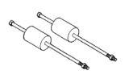

## TRANSMISSION AND TRANSFER CASE 21 - 203

### SPECIAL TOOLS (Continued)

*Fig. 1 Puller, Slide Hammer—C-3752*

[Figure: Installer—C-3995-A]

[Figure: Gauge, Throttle Setting—C-3763]

[Figure: Universal Handle—C-4171]

[Figure: Seal Installer—C-3860-A]

[Figure: Seal Installer—C-4193-A]

[Figure: Seal Remover—C-3985-B]

[Figure: Dial Caliper—C-4962]