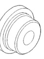
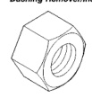
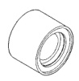
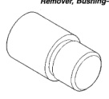
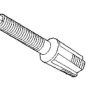
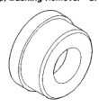
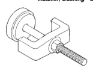

## 21 - 204 TRANSMISSION AND TRANSFER CASE

### SPECIAL TOOLS (Continued)

*Fig. 3 Bushing Remover/Installer Set—C-3887-J*

*Fig. 4 Installer, Bushing—SP-5117*

*Fig. 5 Nut, Bushing Remover—SP-1191, From kit C-3887-J*

*Fig. 6 Remover, Bushing—SP-5324*

*Fig. 7 Cup, Bushing Remover—SP-3633, From kit C-3887-J*

*Fig. 8 Installer, Bushing—SP-5325*

*Fig. 9 Remover, Bushing—SP-3551*

*Fig. 10 Compressor, Spring—C-3575-A*