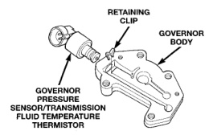
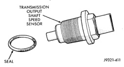

# 21 - 212 TRANSMISSION AND TRANSFER CASE — BR

## DESCRIPTION AND OPERATION (Continued)

*Fig. 5 Governor Pressure Sensor]*
- RETAINING CLIP
- GOVERNOR BODY
- GOVERNOR PRESSURE SENSOR/TRANSMISSION FLUID TEMPERATURE THERMISTOR
- 80000480

### GOVERNOR BODY AND TRANSFER PLATE

The transfer plate is designed to supply transmission line pressure to the governor pressure solenoid valve and to return governor pressure.

The governor pressure solenoid valve is mounted in the governor body. The body is bolted to the lower side of the transfer plate (Fig. 5). The transfer plate channels line pressure to the solenoid valve through the governor body. It also channels governor pressure from the solenoid valve to the governor circuit. It is the solenoid valve that develops the necessary governor pressure.

### TRANSMISSION FLUID TEMPERATURE THERMISTOR

Transmission fluid temperature readings are supplied to the transmission control module by the thermistor. The temperature readings are used to control engagement of the fourth gear overdrive clutch, the converter clutch, and governor pressure. Normal resistance value for the thermistor at room temperature is approximately 1000 ohms.

The PCM prevents engagement of the converter clutch and overdrive clutch, when fluid temperature is below approximately 10°C (50°F).

If fluid temperature exceeds 126°C (260°F), the PCM causes a 4-3 downshift and engage the converter clutch. Engagement is according to the third gear converter clutch engagement schedule.

The overdrive OFF lamp in the instrument panel illuminates when the shift back to third occurs. The transmission will not allow fourth gear operation until fluid temperature decreases to approximately 110°C (230°F).

The thermistor is part of the governor pressure sensor assembly and is immersed in transmission fluid at all times.

### TRANSMISSION SPEED SENSOR

The speed sensor (Fig. 6) is located in the overdrive gear case. The sensor is positioned over the park gear and monitors transmission output shaft rotating speed. Speed sensor signals are triggered by the park gear lugs as they rotate past the sensor pickup face. Input signals from the sensor are sent to the transmission control module for processing. The vehicle speed sensor also serves as a backup for the transmission speed sensor. Signals from this sensor are shared with the powertrain control module.

*Fig. 6 Transmission Output Speed Sensor]*
- TRANSMISSION OUTPUT SHAFT SPEED SENSOR
- SEAL
- 92231-411

### THROTTLE POSITION SENSOR (TPS)

The TPS provides throttle position input signals to the PCM. This input signal is used to determine overdrive and converter clutch shift schedule and to select the proper governor curve.

### POWERTRAIN CONTROL MODULE (PCM)

The PCM controls operation of the converter clutch, overdrive clutch, and governor pressure solenoid.

The control module determines transmission shift points based on input signals from the transmission thermistor, transmission output shaft speed sensor, crankshaft position sensor, vehicle speed sensor, throttle position sensor, and battery temperature sensor.

### GOVERNOR PRESSURE CURVES

There are four governor pressure curves programmed into the transmission control module. The different curves allow the control module to adjust governor pressure for varying conditions. One curve is used for operation when fluid temperature is at, or below, 1°C (30°F). A second curve is used when fluid temperature is at, or above, 10°C (50°F) during normal city or highway driving. A third curve is used during wide-open throttle operation. The fourth curve is used when driving with the transfer case in low range.