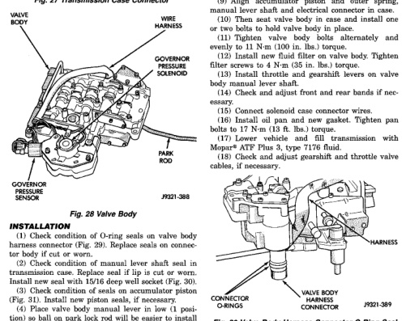
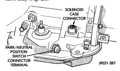

# REMOVAL AND INSTALLATION (Continued)

(11) Lower valve body, rotate valve body away from case, pull park rod out of sprag, and remove valve body (Fig. 28).

*Fig. 27 Transmission Case Connector]*
- SOLENOID CASE CONNECTOR
- PARK/NEUTRAL POSITION SWITCH CONNECTOR
- VALVE BODY
- WIRE HARNESS
- GOVERNOR PRESSURE SOLENOID
- PARK ROD
- GOVERNOR PRESSURE SENSOR

*Fig. 28 Valve Body]*

## INSTALLATION

(1) Check condition of O-ring seals on valve body harness connector (Fig. 29). Replace seals on connector body if cut or worn.
(2) Check condition of manual lever shaft seal in transmission case. Replace seal if lip is cut or worn. Install new seal with 15/16 deep well socket (Fig. 30).
(3) Check condition of seals on accumulator piston (Fig. 31). Install new piston seals, if necessary.
(4) Place valve body manual lever in low (1 position) so ball on park lock rod will be easier to install in sprag.
(5) Lubricate shaft of manual lever with petroleum jelly. This will ease inserting shaft through seal in case.
(6) Lubricate seal rings on valve body harness connector with petroleum jelly.
(7) Position valve body in case and work end of park lock rod into and through pawl sprag. Turn propeller shaft to align sprag and park lock teeth if necessary. The rod will click as it enters pawl. Move rod to check engagement.

**CAUTION:** It is possible for the park rod to displace into a cavity just above the pawl sprag during installation. Make sure the rod is actually engaged in the pawl and has not displaced into this cavity.

(8) Install accumulator springs and piston into case. Then swing valve body over piston and outer spring to hold it in place.
(9) Align accumulator piston and outer spring, manual lever shaft and electrical connector in case.
(10) Then seat valve body in case and install one or two bolts to hold valve body in place.
(11) Tighten valve body bolts alternately and evenly to 11 N·m (100 in. lbs.) torque.
(12) Install new fluid filter on valve body. Tighten filter screws to 4 N·m (35 in. lbs.) torque.
(13) Install throttle and gearshift levers on valve body manual lever shaft.
(14) Check and adjust front and rear bands if necessary.
(15) Connect solenoid case connector wires.
(16) Install oil pan and new gasket. Tighten pan bolts to 17 N·m (13 ft. lbs.) torque.
(17) Lower vehicle and fill transmission with Mopar® ATF Plus 3, type 7176 fluid.
(18) Check and adjust gearshift and throttle valve cables, if necessary.

[Figure: Fig. 29 Valve Body Harness Connector O-Ring Seal]
- HARNESS
- CONNECTOR O-RINGS
- VALVE BODY HARNESS CONNECTOR