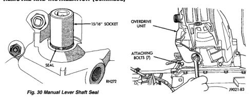

# REMOVAL AND INSTALLATION (Continued)

*Fig. 32 Manual Lever Shaft Seal]*
- SEAL
- 15/16" SOCKET

[Figure: Fig. 32 Overdrive Unit Bolts]
- OVERDRIVE UNIT
- ATTACHING BOLTS (7)

[Figure: Fig. 31 Accumulator Piston Components]
- ACCUMULATOR PISTON
- INNER SPRING
- OUTER SPRING

## OVERDRIVE UNIT

### REMOVAL

(1) Shift transmission into Park.
(2) Raise vehicle.
(3) Mark propeller shaft universal joint(s) and axle pinion yoke for alignment reference at installation.
(4) Disconnect and remove propeller shaft(s).
(5) Remove transmission oil pan, remove gasket, drain oil and reinstall pan.
(6) If overdrive unit had malfunctioned, or if fluid is contaminated, remove entire transmission. If diagnosis indicated overdrive problems only, remove just the overdrive unit.
(7) Support transmission with transmission jack.
(8) Remove vehicle speed sensor and speedometer adapter, if necessary.
(9) Remove bolts attaching overdrive unit to transmission (Fig. 32).

**CAUTION: Support the overdrive unit with a jack before moving it rearward. This is necessary to prevent damaging the intermediate shaft. Do not allow the shaft to support the entire weight of the overdrive unit.**

(10) Carefully work overdrive unit off intermediate shaft. Do not tilt unit during removal. Keep it as level as possible.
(11) If overdrive unit does not require service, immediately insert Alignment Tool 6227-2 in splines of planetary gear and overrunning clutch to prevent splines from rotating out of alignment. If misalignment occurs, overdrive unit will have to be disassembled in order to realign splines.
(12) Remove and retain overdrive piston thrust bearing. Bearing may remain on piston or in clutch hub during removal.
(13) Position drain pan on workbench.
(14) Place overdrive unit over drain pan. Tilt unit to drain residual fluid from case.
(15) Examine fluid for clutch material or metal fragments. If fluid contains these items, overhaul will be necessary.
(16) If overdrive unit does not require any service, leave alignment tool in position. Tool will prevent accidental misalignment of planetary gear and overrunning clutch splines.

### INSTALLATION

(1) Be sure overdrive unit Alignment Tool 6227-2 is fully seated before moving unit. If tool is not seated and gear splines rotate out of alignment, overdrive unit will have to be disassembled in order to realign splines.
(2) If overdrive piston retainer was not removed during service and original case gasket is no longer reusable, prepare new gasket by trimming it.
(3) Cut out old case gasket around piston retainer with razor knife (Fig. 33).
(4) Use old gasket as template and trim new gasket to fit.
(5) Position new gasket over piston retainer and on transmission case. Use petroleum jelly to hold