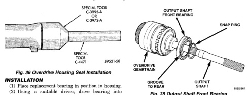
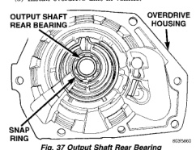
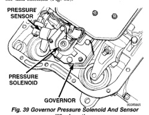

*Fig. 37*

(1) Place replacement bearing in position in housing. (2) Using a suitable driver, drive bearing into housing until the snap ring groove is visible. (3) Install snap ring to hold bearing into housing (Fig. 37). (4) Install overdrive geartrain into housing. (5) Install overdrive unit in vehicle.

*Fig. 38 Output Shaft Rear Bearing*

(1) Remove overdrive unit from the vehicle. (2) Remove overdrive geartrain from housing. (3) Remove snap ring holding output shaft front bearing to overdrive geartrain. (Fig. 38). (4) Pull bearing from output shaft.

(1) Place replacement bearing in position on geartrain with locating retainer groove toward the rear. (2) Push bearing onto shaft until the snap ring groove is visible. (3) Install snap ring to hold bearing onto output shaft (Fig. 38). (4) Install overdrive geartrain into housing. (5) Install overdrive unit in vehicle.

*Fig. 38 Output Shaft Front Bearing*

Remove the valve body from the transmission, refer to Removal and Installation procedures section in this group.

CAUTION: Do not clamp any valve body component in a vise. This practice can damage the component resulting in unsatisfactory operation after assembly and installation. Do not use pliers to remove any of the valves, plugs or springs and do not force any of the components out or into place. The valves and valve body housings will be damaged if force is used. Tag or mark the valve body springs for reference as they are removed. Do not allow them to become intermixed.

(1) Remove fluid filter. (2) Disconnect wires from governor pressure sensor and solenoid (Fig. 39).

*Fig. 39 Governor Pressure Solenoid And Sensor Wire Locations*
