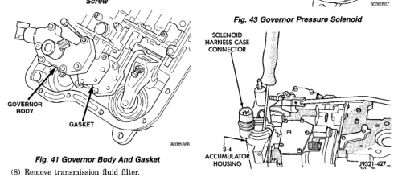
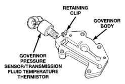
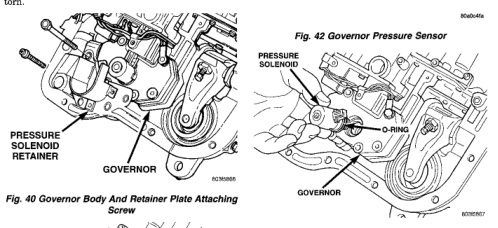

### TRANSMISSION AND TRANSFER CASE -

(3) Remove screws attaching governor body and retainer plate to transfer plate (Fig. 40), (4) Remove retainer plate, governor body and gasket from transfer plate (Fig. 41). (5) Disconnect wires from governor pressure sensor, if not done previously. (6) Remove governor pressure sensor from governor body. Sensor is retained in body with M-shaped spring clip (Fig. 42). Remove clip with small pointed tool and slide sensor out of body. (7) Remove governor pressure solenoid by pulling it straight out of bore in governor body (Fig. 43). Remove and discard solenoid O-rings if worn, cut, or torn.

*Fig. 40 Governor Body And Retainer Plate Attaching Screw*

(8) Remove transmission fluid filter. (9) Remove small shoulder bolt that secures solenoid harness case connector to 3-4 accumulator housing (Fig. 44). Retain shoulder bolt. Either tape it to harness or thread it back into accumulator housing after connector removal.

*Fig. 42 Governor Pressure Sensor*

*Fia. 43 Governor Pressure Solenoid*

*Fig. 44 Solenoid Harness Case Connector Shoulder Bolt*

*Fig. 40*

*Fig. 41*
