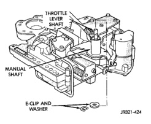
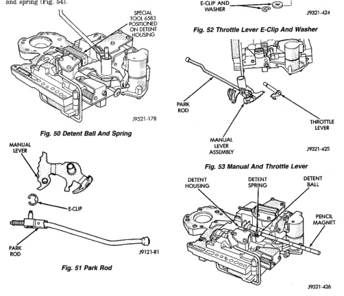

### 21 - 248 - TRANSMISSION AND TRANSFER CASE -

(15) Secure detent ball and spring with Retainer Tool 6583 (Fig. 50). (16) Remove park rod E-clip and separate rod from manual lever (Fig. 51). (17) Remove E-clip and washer that retains throttle lever shaft in manual lever (Fig. 52). (18) Remove manual lever and throttle lever (Fig. 53). Rotate and lift manual lever off valve body and throttle lever shaft. Then slide throttle lever out of valve body. (19) Position pencil magnet next to detent housing to catch detent ball and spring. Then carefully remove Retainer Tool 6583 and remove detent ball and spring (Fig. 54).

*Fig. 51 Park Rod*

*Fig. 50 Throttle Lever E-Clip And Washer*

*Fig. 53 Manual And Throttle Lever*

*Fig. 54 Detent Ball And Spring*

*Fig. 51*
