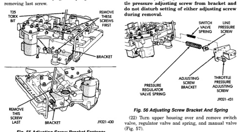
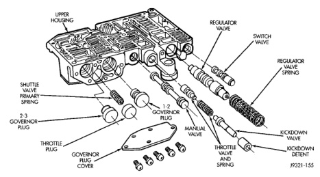

*Fig. 55*

(20) Remove screws attaching pressure adjusting screw bracket to valve body and transfer plate (Fig. 55). Hold bracket firmly against spring tension while

*Flg. 55 Adjusting Screw Bracket Fastener*

(21) Remove adjusting screw bracket, line pressure adjusting screw, pressure regulator valve spring and switch valve spring (Fig. 56). Do not remove throttle pressure adjusting screw from bracket and do not disturb setting of either adjusting screw during removal.

(22) Turn upper housing over and remove switch valve, regulator valve and spring, and manual valve (Fig. 57). (23) Remove kickdown detent, kickdown valve, and throttle valve and spring (Fig. 57).

*Fig. 56 Upper Housing Control Valve Locations*
