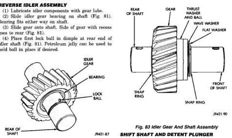
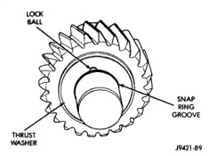

*Fig. 82*

*SHAFT*

(5) Slide thrust rear thrust washer onto shaft and over lock ball (Fig. 82). (6) Install snap ring in groove at rear of shaft (Fig. 82).

*Fig. 83*

(7) Install lock ball in dimple at front of shaft. Hold ball in place with petroleum jelly if desired. (8) Install front thrust washer on shaft and slide washer up against gear and over lock ball (Fig. 83). (9) Install wave washer, flat washer and remaining snap ring on idler shaft (Fig. 83). Be sure snap ring is fully seated.

*J9421-90*

(1) Inspect shift shaft bushing and bearing for damage. (2) If necessary, the shift shaft bushing can be replaced as follows: (a) Locate a bolt that will thread into the bushing without great effort. (b) Thread the bolt into the bushing, allowing the bolt to make its own threads in the bushing. (c) Attach a slide hammer or suitable puller to the bolt and remove bushing. (d) Use the short end of Installer 8119 to install the new bushing. (e) The bushing is correctly installed if the bushing is flush with the transmission case. (3) If necessary, the shift shaft bearing can be replaced as follows: (a) Locate a bolt that will thread into the bearing without great effort. (b) Thread the bolt into the bearing as much as possible. (c) Attach a slide hammer or suitable puller to

the bolt and remove the bearing. (d) Use the short end of Installer 8119 to install the new bearing. (e) The bearing is correctly installed if the bearing is flush with the transmission case. (4) Inspect detent plunger bushings for damage.
