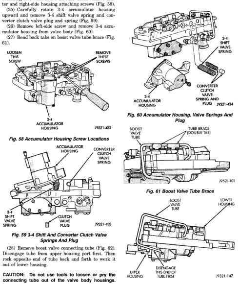

*Fig. 58*

(24) Loosen left-side 3-4 accumulator housing attaching screw about 2-3 threads. Then remove center and right-side housing attaching screws (Fig. 58), (25) Carefully rotate 3-4 accumulator housing upward and remove 3-4 shift valve spring and converter clutch valve plug and spring (Fig. 59). (26) Remove left-side screw and remove 3-4 accumulator housing from valve body (Fig. 60). (27) Bend back tabs on boost valve tube brace (Fig. 61).

*Fig. 58 Accumulator Housing Screw Locations*

*Springs And Plug*

CAUTION: Do not use tools to loosen or pry the connecting tube out of the valve body housings. Loosen and remove the tube by hand only.

*Fig. 60 Accumulator Housing. Valve Springs And*

*Fig. 61 Boost Valve Tube Brace*

*Fig. 62 Boost Valve Tube*
