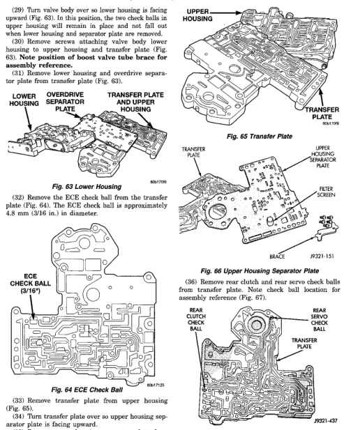

## DISASSEMBLY AND ASSEMBLY (Continued)

(29) Turn valve body over so lower housing is facing upward (Fig. 63). In this position, the two check balls in upper housing will remain in place and not fall out when lower housing and separator plate are removed.

(30) Remove lower housing, separator plate, and lower housing to upper housing and transfer plate (Fig. 63). Note position of boost valve tube brace for assembly reference.

(31) Remove lower housing and overdrive separator plate from transfer plate (Fig. 63).

*Fig. 65 Lower Housing]*
- LOWER HOUSING
- OVERDRIVE SEPARATOR PLATE
- TRANSFER PLATE AND UPPER HOUSING
- TRANSFER PLATE

(32) Remove the ECE check ball from the transfer plate (Fig. 64). The ECE check ball is approximately 4.8 mm (3/16 in.) in diameter.

[Figure: Fig. 64 ECE Check Ball]
- ECE CHECK BALL

(33) Remove transfer plate from upper housing (Fig. 65).

[Figure: Fig. 65 Transfer Plate]
- UPPER HOUSING
- TRANSFER PLATE

(34) Turn transfer plate over so upper housing separator plate is facing upward.

(35) Remove upper housing separator plate from transfer plate (Fig. 66). Note position of filter in separator plate for assembly reference.

[Figure: Fig. 66 Upper Housing Separator Plate]
- TRANSFER PLATE
- UPPER HOUSING SEPARATOR PLATE
- FILTER SCREEN

(36) Remove rear clutch and rear servo check balls from transfer plate. Note check ball location for assembly reference (Fig. 67).

[Figure: Fig. 67 Rear Clutch And Rear Servo Check Ball Locations]
- REAR CLUTCH CHECK BALL
- REAR SERVO CHECK BALL
- TRANSFER PLATE