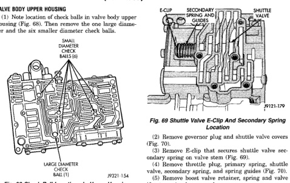
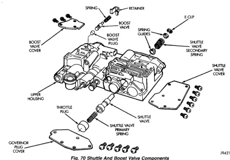

## DISASSEMBLY AND ASSEMBLY (Continued)

### VALVE BODY UPPER HOUSING

(1) Note location of check balls in valve body upper housing (Fig. 68). Then remove the one large diameter and the six smaller diameter check balls.

*Fig. 68 Check Ball Locations In Upper Housing]*
- ONE LARGE DIAMETER CHECK BALL
- SIX SMALL DIAMETER CHECK BALLS
- LARGE DIAMETER CHECK BALL

*Fig. 69 Shuttle Valve E-Clip And Secondary Spring Location]*
- E-CLIP
- SECONDARY SPRING AND SPRING GUIDE
- SHUTTLE VALVE

(2) Remove governor plug and shuttle valve covers (Fig. 70).

(3) Remove E-clip that secures shuttle valve secondary spring on valve stem (Fig. 69).

(4) Remove throttle plug, primary spring, shuttle valve, secondary spring, and spring guides (Fig. 70).

(5) Remove boost valve retainer, spring and valve if not previously removed.

[Figure: Fig. 70 Shuttle And Boost Valve Components]
- SPRING
- RETAINER
- E-CLIP
- BOOST VALVE
- SPRING GUIDES
- BOOST VALVE COVER
- BOOST VALVE
- SHUTTLE VALVE SECONDARY SPRING
- SHUTTLE VALVE COVER
- UPPER HOUSING
- THROTTLE PLUG
- SHUTTLE VALVE
- SHUTTLE VALVE PRIMARY SPRING
- GOVERNOR PLUG COVER