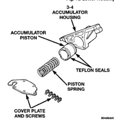
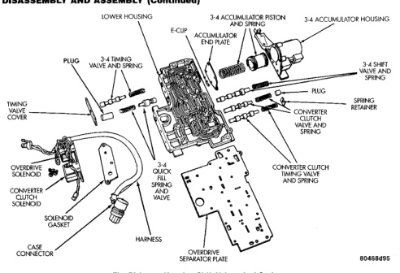

*Fig. 2*

*Fig. 73*

(4) Install 3-4 quick fill valve spring and plug in housing

(5) Install timing valve end plate. Tighten end plate screws to 4 N.m (35 in. Ibs.) torque.

(1) Lubricate accumulator piston, seals and housing piston bore with clean transmission fluid (Fig. 73). (2) Install new seal rings on accumulator piston. (3) Install piston and spring in housing. (4) Install end plate on housing.
