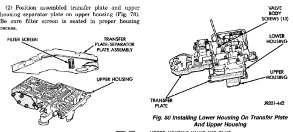
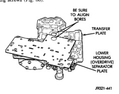

*Fig. 64*

(3) Install the ECE check ball into the transfer plate (Fig. 64). The ECE check ball is approximately 4.8 mm (3/16 in.) in diameter. (4) Position lower housing separator plate on transfer plate (Fig. 79). (5) Install lower housing on assembled transfer plate and upper housing (Fig. 80). (6) Install and start all valve body screws by hand except for the screws to hold the boost valve tube brace. Save those screws for later installation. Then tighten screws evenly to 4 N-m (35 in. lbs.) torque. Start at center and work out to sides when tightening screws (Fig. 80).

*Fig. 79 Lower Housing Separator Plate*

*Fig. 80 Installing Lower Housing On Transfer Plate*

Refer to (Fig. 81), (Fig. 82) and (Fig. 83) to perform the following steps. (1) Lubricate valves, plugs, springs with clean transmission fluid. (2) Assemble regulator valve line pressure plug, sleeve, throttle plug and spring. Insert assembly in upper housing and install cover plate. Tighten cover plate screws to 4 N-m (35 in. Ibs.) torque. (3) Install 1-2 and 2-3 shift valves and springs. (4) Install 1-2 shift control valve and spring. (5) Install retainer, spring, limit valve, and 2-3 throttle plug from limit valve housing. (6) Install limit valve housing and cover plate. Tighten screws to 4 N.m (35 in. lbs.). (7) Install shuttle valve as follows: (a) Insert plastic guides in shuttle valve secondarv spring and install spring on end of valve. (b) Install shuttle valve into housing. (c) Hold shuttle valve in place. (d) Compress secondary spring and install E-clip in groove at end of shuttle valve. (e) Verify that spring and E-clip are properly seated before proceeding. (8) Install shuttle valve cover plate. Tighten cover plate screws to 4 N·m (35 in. Ibs.) torque. (9) Install 1-2 and 2-3 valve governor plugs in valve body. (10) Install shuttle valve primary spring and throttle plug. (11) Align and install governor plug cover. Tighten cover screws to 4 N.m (35 in. Ibs.) torque.
