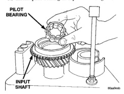
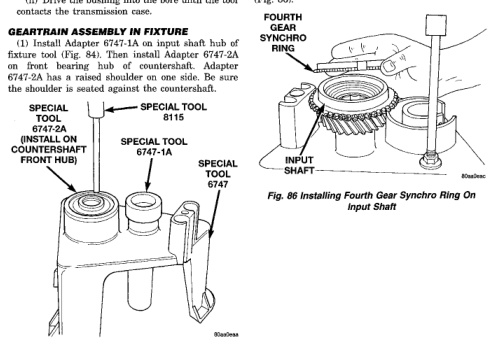

NOTE: The detent plunger bushings are installed to a specific depth. The space between the two bushings when correctly installed contain an oil feed hole. Do not attempt to install the bushings with anything other than the specified tool or this oil hole may become restricted.

(5) If necessary, the detent plunger bushings can be replaced as follows: (a) Using the long end of Installer 8119, drive the detent bushings through the outer case and into the shift shaft bore. (b) Remove the bushings from the shift shaft bore. (c) Install a new detent plunger bushing on the long end of Installer 8118. (d) Start the bushing in the detent plunger bore in the case. (e) Drive the bushing into the bore until the tool contacts the transmission case. (f) Install a new detent plunger bushing on the short end of Installer 8118. (g) Start the bushing in the detent plunger bore in the case. (h) Drive the bushing into the bore until the tool contacts the transmission case.

*Fig. 84 Preparing Assembly Fixture For Geartrain Build-up*

(2) Install input shaft in fixture tool. Make sure Adapter Tool 6747-1A is positioned under shaft as shown (Fig. 85). (3) Install pilot bearing in input shaft (Fig. 85).

*Fig. 84*

(4) Install fourth gear svnchro ring on input shaft (Fig. 86).

*Fig. 86 Installing Fourth Gear Synchro Ring On Input Shaft*

*Fig. 85*
