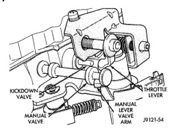
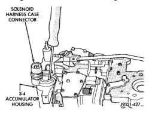
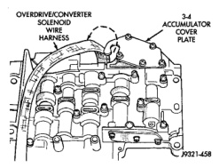

(5) Align manual lever with detent ball and manual valve. Hold throttle lever upward. Then press down on manual lever until fully seated. Remove detent ball retainer tool after lever is seated. (6) Then install manual lever seal, washer and E-clip. (7) Verify that throttle lever is aligned with end of kickdown valve stem and that manual lever arm is engaged in manual valve (Fig. 90). (8) Position line pressure adjusting screw in adjusting screw bracket. (9) Install spring on end of line pressure regulator valve. (10) Install switch valve spring on tang at end of adjusting screw bracket. (11) Install manual valve. (12) Install throttle valve and spring. (13) Install kickdown valve and detent. (14) Install pressure regulator valve. (15) Install switch valve. (16) Position adjusting screw bracket on valve body. Align valve springs and press bracket into place. Install short, upper bracket screws first and long bottom screw last. Verify that valve springs and bracket are properly aligned. Then tighten all three bracket screws to 4 N-m (35 in. lbs.) torque. (17) Lubricate solenoid case connector O-rings and shaft of manual lever with light coat of petroleum jelly. (18) Obtain new fluid filter for valve body but do not install filter at this time. (19) If line pressure and/or throttle pressure adjustment screw settings were not disturbed, continue with overhaul or reassembly. However, if adjustment screw settings were moved or changed, readjust as described in Valve Body Control Pressure Adjustment procedure. (20) Attach solenoid case connector to 3-4 accumulator with shoulder-type screw. Connector has small locating tang that fits in dimple at top of accumulator housing (Fig. 91). Seat tang in dimple before tightening connector screw. (21) Install solenoid assembly and gasket. Tighten solenoid attaching screws to 8 N-m (72 in. Ibs.) torque. (22) Verify that solenoid wire harness is properly routed (Fig. 92). Solenoid harness must be clear of manual lever and park rod and not be pinched between accumulator housing and cover.

*Fig. 90 Manual And Throttle Lever Alignment*

*Fig. 91 Solenoid Harness Case Connector Shoulder Bolt*

*Fig. 92 Solenold Harness Routing*
