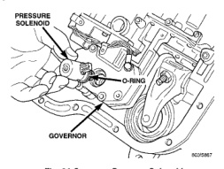
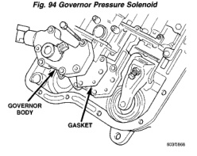
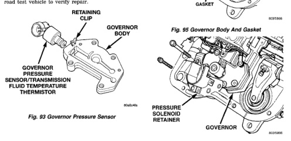

# BR TRANSMISSION AND TRANSFER CASE 21-261

## DISASSEMBLY AND ASSEMBLY (Continued)

### GOVERNOR BODY, SENSOR AND SOLENOID

(1) Turn valve body assembly over so accumulator side of transfer plate is facing down.

(2) Install new O-rings on governor pressure solenoid and sensor (Fig. 93).

(3) Lubricate solenoid and sensor O-rings with clean transmission fluid.

(4) Install governor pressure sensor in governor body. Then secure sensor with M-shaped retaining clip (Fig. 93).

(5) Install governor pressure solenoid in governor body (Fig. 94). Push solenoid in until it snaps into place in body.

(6) Position governor body gasket on transfer plate (Fig. 95).

(7) Install retainer plate on governor body and around solenoid (Fig. 96). Be sure solenoid connector is positioned in retainer cutout.

(8) Align screw holes in governor body and transfer plate. Then install and tighten governor body screws to 4 N·m (35 in. lbs.) torque.

(9) Connect harness wires to governor pressure solenoid and governor pressure sensor (Fig. 97).

(10) Perform Line Pressure and Throttle Pressure adjustments, refer to adjustment section of this group for proper procedures.

(11) Install fluid filter and pan.

(12) Lower vehicle.

(13) Fill transmission with recommended fluid and road test vehicle to verify repair.

*Fig. 93 Governor Pressure Sensor]*
- RETAINING CLIP
- GOVERNOR BODY
- GOVERNOR PRESSURE SENSOR/TRANSMISSION FLUID TEMPERATURE THERMISTOR

*Fig. 94 Governor Pressure Solenoid]*
- PRESSURE SOLENOID
- GOVERNOR

*Fig. 95 Governor Body And Gasket]*
- GOVERNOR BODY
- GASKET

[Figure: Fig. 96 Pressure Solenoid Retainer]
- PRESSURE SOLENOID RETAINER
- GOVERNOR