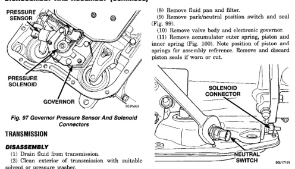

# 21-262 TRANSMISSION AND TRANSFER CASE BR

## DISASSEMBLY AND ASSEMBLY (Continued)

*Fig. 97 Governor Pressure Sensor And Solenoid Connectors]*
- PRESSURE SENSOR
- PRESSURE SOLENOID
- GOVERNOR

### TRANSMISSION

#### DISASSEMBLY

(1) Drain fluid from transmission.

(2) Clean exterior of transmission with suitable solvent or pressure washer.

(3) Remove torque converter from front of transmission.

(4) Remove throttle and shift levers from valve body manual shaft and throttle lever shaft.

(5) Place transmission in vertical position.

(6) Measure and record the input shaft end-play measurement.

(7) Mount transmission in repair stand C-3750-B or similar type stand (Fig. 98).

[Figure: Fig. 98 Repair Stand]
- INPUT SHAFT
- PUMP SEAL PROTECTOR
- REACTION SHAFT
- REPAIR STAND

(8) Remove fluid pan and filter.

(9) Remove park/neutral position switch and seal (Fig. 99).

(10) Remove valve body and electronic governor.

(11) Remove accumulator outer spring, piston and inner spring (Fig. 100). Note position of piston and springs for assembly reference. Remove and discard piston seals if worn or cut.

[Figure: Fig. 99 Park/Neutral Position Switch]
- SOLENOID CONNECTOR
- NEUTRAL SWITCH

[Figure: Fig. 100 Accumulator Component Removal]
- ACCUMULATOR COVER
- OUTER SPRING
- INNER SPRING

(12) Remove pump oil seal with suitable pry tool or slide-hammer mounted screw.