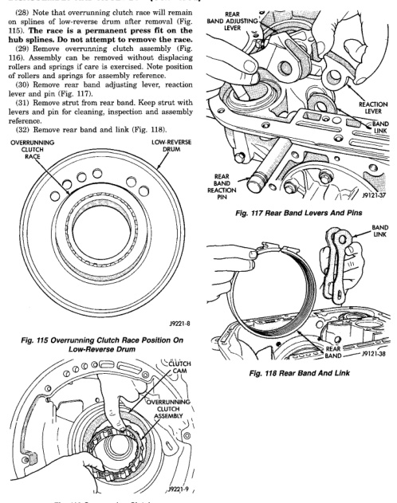

# 21 - 266 TRANSMISSION AND TRANSFER CASE — BR

## DISASSEMBLY AND ASSEMBLY (Continued)

(28) Note that overrunning clutch race will remain on splines of low-reverse drum after removal (Fig. 115). Race is a press fit on drum and is serviced with hub splines. Do not attempt to remove the race.

(29) Remove overrunning clutch assembly (Fig. 116). Assembly can be removed without displacing rollers and springs if care is exercised. Note position of clutch cam in assembly reference.

(30) Remove rear band adjusting lever, reaction lever and pin (Fig. 117).

(31) Remove strut from rear band. Keep strut with levers and pin for cleaning, inspection and assembly reference.

(32) Remove rear band and link (Fig. 118).

*Fig. 115 Overrunning Clutch Race Position On Low-Reverse Drum]*
- OVERRUNNING CLUTCH RACE
- LOW-REVERSE DRUM
- J9121-6

[Figure: Fig. 116 Overrunning Clutch]
- CLUTCH CAM
- OVERRUNNING CLUTCH ASSEMBLY
- J9121-9

[Figure: Fig. 117 Rear Band Levers And Pins]
- REAR BAND ADJUSTING LEVER
- REACTION LEVER
- REACTION LEVER PIN
- REAR BAND
- BAND LINK
- J9121-37

[Figure: Fig. 118 Rear Band And Link]
- BAND LINK
- REAR BAND
- J9121-38