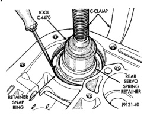
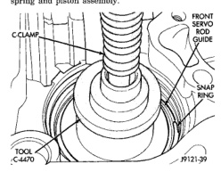

(33) Compress front servo rod guide with large C-clamp and Tool C-4470, or Compressor Tool C-3422-B (Fig. 119). Compress guide only enough to permit snap ring removal (about 1/8 in.). (34) Remove servo piston snap ring (Fig. 119), Unseat one end of ring. Then carefully work removal tool around back of ring until free of ring groove. Exercise caution when removing snap ring. Servo bore can be scratched or nicked if care is not exercised. (35) Remove tools and remove servo piston and spring. (36) Compress rear servo piston with C-clamp and Tool C-4470, or Valve Spring Compressor C-3422-B (Fig. 120). Compress servo spring retainer only enough to permit snap ring removal. (37) Remove servo piston snap ring (Fig. 120). Start one end of ring out of bore. Then carefully work removal tool around back of snap ring until free of ring groove. Exercise caution when removing snap ring. Servo bore can be scratched or nicked if care is not exercised. (38) Remove tools and remove rear servo retainer. spring and piston assembly.

*Fig. 119*

Do not allow dirt, grease, or foreign material to enter the case or transmission components during assembly. Keep the transmission case and components clean. Also make sure the tools and workbench area used for reassembly operations are equally clean. Shop towels used for wiping off tools and your hands must be made from lint free materials. Lint will stick to transmission parts and could interfere with valve operation or even restrict fluid passages. Lubricate transmission clutch and gear components with Mopar® ATF Plus 3, type 7176, during

*Fig. 120*

reassembly. Soak clutch discs in transmission fluid before installation. Use Mopar® Door Ease, or Ru-Glyde on piston seals and O-rings to ease installation. Petroleum jelly can also be used to lubricate and hold thrust washers and plates in position during assembly. Do not use chassis grease, bearing grease, white grease, or similar lubricants on any part. These types of lubricants can eventually block or restrict fluid passages and valve operation. Use petroleum jelly only. Do not force parts into place. The transmission components and sub-assemblies are easily installed by hand when properly aligned. If a part seems difficult to install, it is either misaligned or incorrectly assembled. Verify that thrust washers, thrust plates and seal rings are correctly positioned. The planetary geartrain, front/rear clutch assemblies and oil pump are all much easier to install when the transmission case is upright. Either tilt the case upward with wood blocks, or cut a hole in the bench large enough for the intermediate shaft and rear support. Then lower the shaft and support into the hole and support the rear of the case directly on the bench.

(1) Lubricate rear servo piston seal with Mopar® Door Ease or ATF Plus 3. Lubricate servo bore in case with ATF Plus 3. (2) Install rear servo piston in case. Position piston at slight angle to bore and insert piston with twisting motion (Fig. 121). (3) Install rear servo spring and retainer in case bore (Fig. 122). Be sure spring is seated on piston. (4) Compress rear servo piston with C-clamp or Valve Spring Compressor C-3422-B and install servo piston snap ring (Fig. 123).
