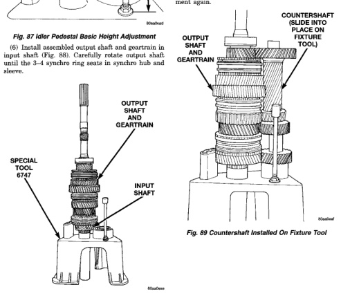
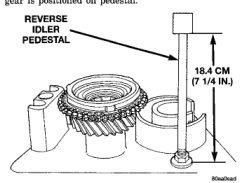

(5) Adjust height of idler gear pedestal on assembly fixture (Fig. 87). Start with a basic height of 18.4 cm (7-1/4 in.). Final adjustment can be made after gear is positioned on pedestal.

*Fig. 88 Output Shaft And Geartrain Installed in Input Shaft*

(7) Install Adapter 6747-2A on front bearing hub of countershaft, if not previously done. The adapter has a shoulder on one side. The shoulder goes toward the countershaft. (8) Slide countershaft (and adapter) into fixture slot. Verify that countershaft and output shaft gears are fully meshod with the mainshaft gears before proceeding (Fig. 89). (9) Check alignment of countershaft and output shaft gear teeth. Note that gears may not align perfectly. A difference in height of 1.57 to 3.18 mm (1/16 to 1/8 in.) will probably exist. This difference will not interfere with assembly. However, if the difference is greater than this, the countershaft adapter tool is probably upside down. Remove countershaft, reverse adapter tool, reinstall countershaft and check alignment again.

*Fig. 89 Countershaft Installed On Fixture Tool*

*Fig. 87*
