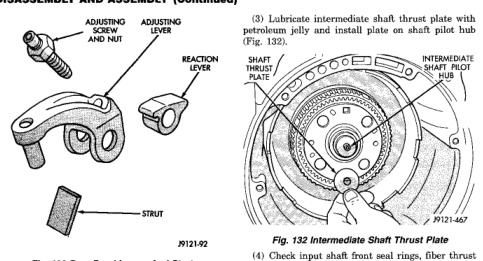
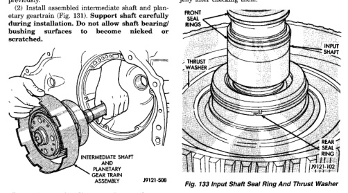

*Fig. 131*

### SSION AND TRANSFER CASE -

(1) Remove Alignment Shaft 6227-2, if installed previously. (2) Install assembled intermediate shaft and planetary geartrain (Fig. 131). Support shaft carefully during installation. Do not allow shaft bearing/ bushing surfaces to become nicked or scratched.

*Fig. 131 Intermediate Shaft And Planetary Geartrain*

(4) Check input shaft front seal rings, fiber thrust washer and rear seal ring (Fig. 133). Be ends of rear seal ring are hooked together and diagonal cut ends of front seal rings are firmly seated against each other as shown. Lubricate seal rings with petroleum jelly after checking them.

*Fig. 133 Input Shaft Seal Ring And Thrust Washer*

*Fig. 132*
