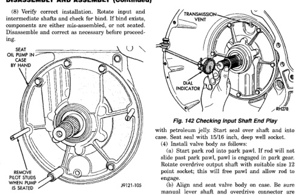
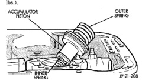

*Fig. 142*

NOTE: Overdrive unit must be installed in order to correctly measure the input shaft end-play.

(1) Check input shaft end play as follows. (2) Attach dial indicator to converter housing (Fig. 142). Position indicator plunger against input shaft and zero indicator. (3) Move input shaft in and out and record reading (4) End play should be 0.86 - 2.13 mm (0.034 - 0.084 in.). (5) If end play is incorrect, change intermediate shaft thrust washer. The thrust washer controls end play and is available in three thicknesses for adjustment purposes.

(1) Install accumulator inner spring, piston and outer spring (Fig. 143). (2) Verify that park/neutral position switch has not been installed in case. Valve body can not be installed if switch is in position. (3) Install new valve body manual shaft seal in case (Fig. 144). Lubricate seal lip and manual shaft

with petroleum jelly. Start seal over shaft and into case. Seat seal with 15/16 inch, deep well socket. (4) Install valve body as follows: (a) Start park rod into park pawl. If rod will not slide past park pawl, pawl is engaged in park gear. Rotate overdrive output shaft with suitable size 12 point socket; this will free pawl and allow rod to engage. (b) Align and seat valve body on case. Be sure manual lever shaft and overdrive connector are fully seated in case. (c) Install and start all valve body attaching bolts by hand. Then tighten bolts evenly, in a diagonal pattern to 12 N-m (105 in. Ibs.) torque. Do not overtighten valve body bolts. This could result in distortion and cross leakage after installation .. (5) Install new filter on valve body. Tighten filter screws to 4 N-m (35 in. lbs.). (6) Install seal on park/neutral position switch. Then install and tighten switch to 34 N.m (25 ft. lbs.).

*Fig. 143 Accumulator Piston And Springs*
