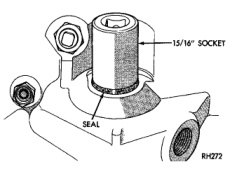
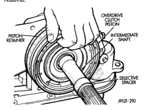

*Fig. 145*

CAUTION: If the condition of the transmission before the overhaul procedure caused excessive metallic or fiber contamination in the fluid, replace the torque converter and reverse flush the cooler(s) and cooler lines. Fluid contamination and transmission failure can result if not done.

(7) Install torque converter. Use C-clamp or metal strap to hold converter in place for installation.

(1) Adjust front and rear bands as follows: (a) Loosen locknut on each band adjusting screw 4-5 turns. (b) Tighten both adjusting screws to 8 N.m (72 in, lbs.). (c) Back off front band adjusting screw 2-7/8 turns. (d) Back off rear band adjusting screw 2 turns. (e) Hold each adjusting screw in position and tighten locknut to 34 N.m (25 ft. lbs.) torque. (2) Install magnet in oil pan. Magnet seats on small protrusion at corner of pan. (3) Position new oil pan gasket on case and install oil pan. Tighten pan bolts to 17 N.m (13 ft. lbs.). (4) Install throttle valve and shift selector levers on valve body manual lever shaft. (5) Apply small quantity of dielectric grease to terminal pins of solenoid case connector and neutral switch. (6) Fill transmission with recommended fluid. Refer to Service Procedures section of this group. (7) Road test vehicle to verify repair.

NOTE: TO SERVICE THE OVERRUNNING CLUTCH CAM AND THE OVERDRIVE PISTON RETAINER, THE TRANSMISSION GEARTRAIN AND OVERDRIVE

SION.

(1) Remove the overdrive piston (Fig. 145). (2) Remove the overdrive piston retainer bolts. (3) Remove overdrive piston retainer. (4) Remove case gasket. (5) Tap old cam out of case with pin punch. Insert punch through bolt holes at rear of case (Fig. 146). Alternate position of punch to avoid cocking cam during removal. (6) Clean clutch cam bore and case. Be sure to remove all chips/shavings generated during cam removal.

*Fig. 146 Overdrive Piston Removal*

[Figure]

(1) Temporarily install overdrive piston retainer in case. Use 3-4 bolts to secure retainer. (2) Align and start new clutch cam and spring retainer in case. Be sure serrations on cam and in
