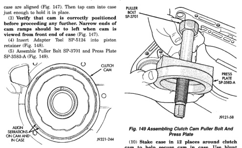
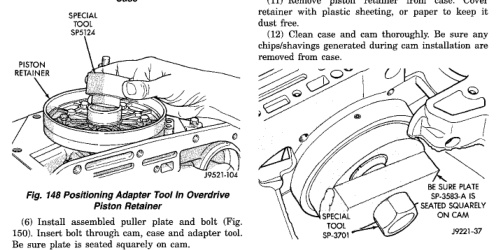

# DISASSEMBLY AND ASSEMBLY (Continued)

case are aligned (Fig. 147). Then tap cam into case just enough to hold it in place.

(3) Verify that cam is correctly positioned before proceeding any further. Narrow ends of cam should be at 12 and 6 o'clock when case is viewed from front end of case (Fig. 147).

(4) Insert Adapter Tool SP-5134 into piston retainer (Fig. 148).

(5) Assemble Puller Bolt SP-3701 and Press Plate SP-3088-A (Fig. 149).

*Fig. 147 Positioning Replacement Clutch Cam In Case]*
- ALIGN SERRATIONS ON CAM WITH SERRATIONS IN CASE
- CLUTCH CAM

*Fig. 150 Positioning Adapter Tool In Overdrive Piston Retainer]*
- SPECIAL TOOL SP-5134
- PISTON RETAINER

[Figure: Fig. 149 Assembling Clutch Cam Puller Bolt And Press Plate]
- PULLER BOLT SP-3701
- PRESS PLATE SP-3088-A

(6) Install assembled puller plate and bolt (Fig. 150). Insert bolt through cam, case and adapter tool. Be sure plate is seated squarely on cam.

(7) Hold puller plate and bolt in place and install puller nut SP-3701 on puller bolt (Fig. 151).

(8) Tighten puller nut to press clutch cam into case (Fig. 151). Be sure cam is pressed into case evenly and does not become cocked.

(9) Remove clutch cam installer tools.

(10) Stake case in 12 places around clutch cam to help secure cam in case. Use blunt punch or chisel to stake case.

(11) Remove piston retainer from case. Cover retainer with plastic sheeting, or paper to keep it dust free.

(12) Clean case and cam thoroughly. Be sure any chips/shavings generated during cam installation are removed from case.

[Figure: Fig. 150 Positioning Puller Plate On Clutch Cam]
- SPECIAL TOOL SP-3088 PLATE SEATED SQUARELY ON CAM

(13) Install new gasket at rear of transmission case. Use petroleum jelly to hold gasket in place. Be sure to align governor feed holes in gasket with feed passages in case (Fig. 152). Also install gasket before overdrive piston retainer. Center hole in gasket is